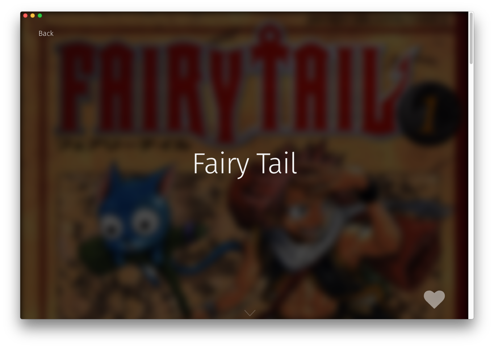

BookHero
========
The [Book Hero](../../components/BookHero) component is our title page, meant to show off the book. The bookmark button is also housed here.


How to use
----------
```js
import BookHero from "renderer/components/BookHero";

<BookHero className="book-view__hero" book={book} dispatch={dispatch} />
```

#### Props
 * `book`: We need to pass the book so we can display the information
 * `dispatch`: We need to pass this through in order to use our [bookmarkIcon](../bookmarkIcon)
 * `className` (Optional): Any class name passed in will be attached to the component.

#### ClassNames
 * `.book-hero`: Our main class
 * `.book-hero__title`: The title of our book
 * `.book-hero__image`: The background image of our book
 * `.book-hero__back`: The back button in the top left
 * `.book-hero__bookmark-icon`: The bookmark icon component
 * `.book-hero__arrow`: The down arrow at the bottom of the component
