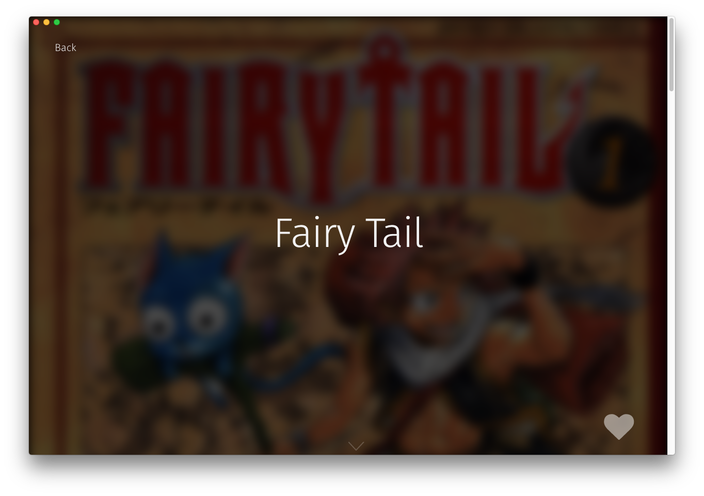

BookView
========
The Book View displays information about a single Manga book.

How to use
------------
```js
import BookView from "renderer/components/BookView";

<BookView book={book} dispatch={dispatch} />
```

#### Props
 * `book`: We need to pass the book so we can display the information
 * `dispatch`: We need to pass this through in order to use our [bookHero](../../components/bookHero)
 * `className` (Optional): Any class name passed in will be attached to the component.

#### ClassNames
 * `.book-view`: Our main class
 * `.book-view--loading`: This class is present when a book-view is loading.

How it works
------------
A `BookView` component receives the data of a single book from store, and will fire a fetchBook action to receive updated book information on each load. A book view is made up of two parts:

#### Book Hero
The [Book Hero](../../components/BookHero) component is our title page, meant to show off the book. The bookmark button is here as well.


#### Book Info
The [Book Info](../../components/BookInfo) component houses information about the Book. As of v1.0, this only holds a chapter list, but we're looking into expanding this page's functionality in the future.

