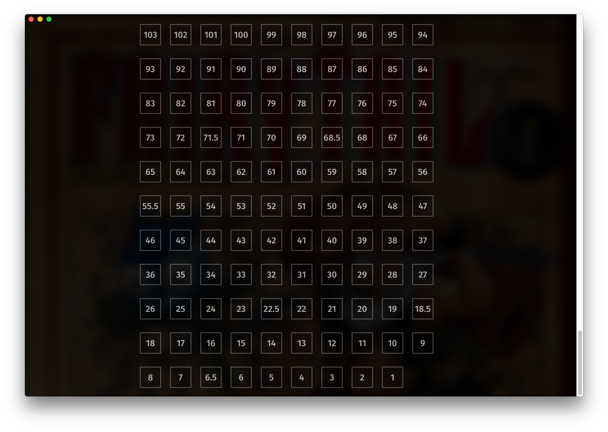

BookInfo
========
The [Book Info](../../components/BookInfo) contains information about a Book. Currently, it simply displays our [ChapterList](../ChapterList).


How to use
----------
```js
import BookInfo from "renderer/components/BookInfo";

<BookInfo className="book-view__info" book={book} />
```

#### Props
 * `book`: We need to pass the book so we can display our book's information
 * `className` (Optional): Any class name passed in will be attached to the component.

#### ClassNames
 * `.book-info`: Our main class
 * `.book-info__chapters`: Our chapter-list
 * `.book-info__description`: The paragraph of text describing the chapter.
