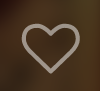

Bookmark Icon
=============
Bookmark Icon is a button to add a bookmark, as well as an icon to signify whether a book is, in fact, bookmarked.

Bookmarked | Not Bookmarked
-----------|-----------------
 | 

How to use
----------
Passing in the dispatcher and the related book are all we need to run the `BookmarkIcon` component:
```js
import BookmarkIcon from "renderer/components/BookmarkIcon";

<BookmarkIcon book={book} dispatch={dispatch} />
```

#### Props
* `book`: The book we are setting a bookmark on
* `dispatch`: The dispatcher for our store
* `className` (Optional): We can add classes to an BookmarkIcon component

#### ClassNames
 * `.bookmark-icon`: Our main class
 * `.bookmark-icon--bookmarked`: Class that's appended when a bookmark-icon is bookmarked
