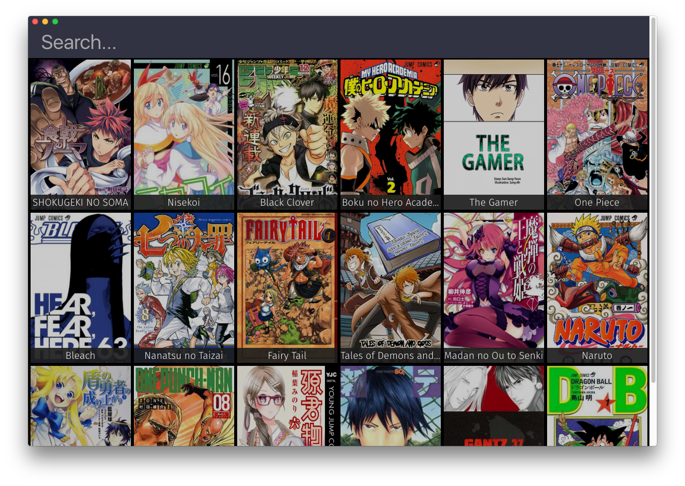

LibraryView
============
The Library View displays all of our Books.



How to use
----------
```js
import LibraryView from "app/components/LibraryView";

<LibraryView />
```

#### Props
* `library`: Our manga data as a Library model
* `className` (Optional): We can pass classNames to LibraryView container

#### ClassNames
* `.library-view`: Main class
* `.library-view__search`: The search bar
* `.library-view__books`: Our book list
* `.library-view--loading`: Class for when we're loading the library